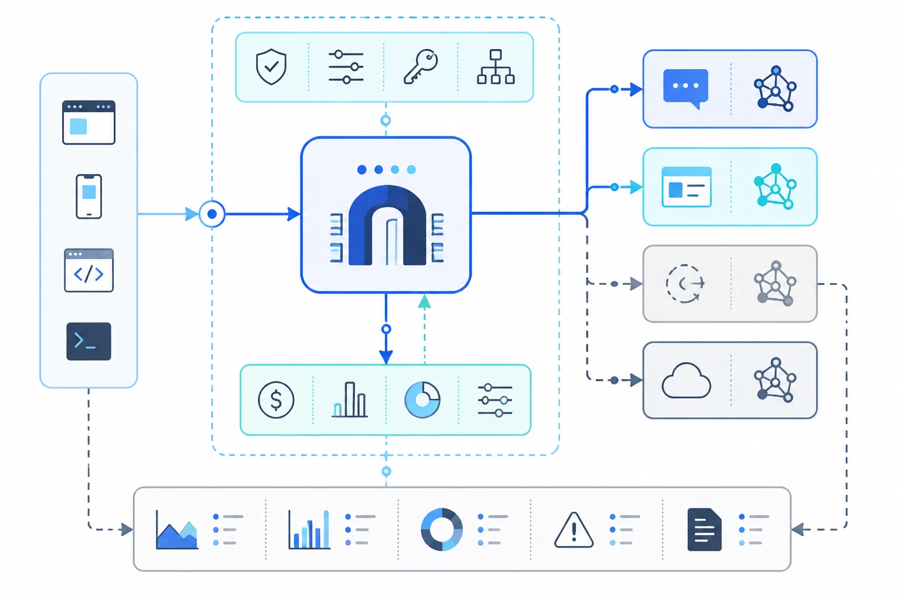

# GPT-5.5 API Guide: Pricing, Model ID, Context Window, and Live Test


OpenAI lists `gpt-5.5` as a frontier model for complex professional work, with a 1,050,000-token context window and 128,000 max output tokens. Crazyrouter has also listed `gpt-5.5`, so developers can call it through an OpenAI-compatible API gateway without changing SDK patterns. The main question is not whether the **gpt-5.5 api** works. It is where the model earns its higher cost.

The short answer: use GPT-5.5 when quality matters more than unit price. It fits complex coding, long-document analysis, agent workflows, and professional reasoning tasks. For summaries, routing, tagging, and bulk content cleanup, a cheaper model will often be the better default.

## GPT-5.5 API Quick Facts

| Item | Value |
|---|---|
| Model ID | `gpt-5.5` |
| OpenAI positioning | Frontier model for complex professional work |
| Context window | 1,050,000 tokens |
| Max output | 128,000 tokens |
| Input modalities | Text and image |
| Output modalities | Text |
| Reasoning effort | `none`, `low`, `medium`, `high`, `xhigh` |
| Supported endpoints | `/v1/chat/completions`, `/v1/responses`, `/v1/batch` |
| Streaming | Supported |
| Function calling | Supported |
| Structured outputs | Supported |
| Fine-tuning | Not supported |

OpenAI's model page prices GPT-5.5 at $5 per 1M input tokens, $0.50 per 1M cached input tokens, and $30 per 1M output tokens. It also notes a higher pricing rule for sessions above 272K input tokens: input is priced at 2x and output at 1.5x for the full session (Source: OpenAI model docs, 2026).

## Crazyrouter Endpoint and API Format

Crazyrouter exposes OpenAI-compatible routes. For OpenAI SDKs, use:

```text
https://crazyrouter.com/v1
```

For users in China who want the optimized API line, Crazyrouter documents:

```text
https://cn.crazyrouter.com/v1
```

The Chat Completions endpoint is:

```text
POST https://crazyrouter.com/v1/chat/completions
```

The Responses API endpoint is:

```text
POST https://crazyrouter.com/v1/responses
```

Authentication uses a bearer token:

```text
Authorization: Bearer YOUR_API_KEY
```

## Live GPT-5.5 API Test Through Crazyrouter

I tested `gpt-5.5` through Crazyrouter's OpenAI-compatible Chat Completions endpoint before writing this guide.

Test request:

```bash
curl https://crazyrouter.com/v1/chat/completions \
  -H "Content-Type: application/json" \
  -H "Authorization: Bearer YOUR_API_KEY" \
  -d '{
    "model": "gpt-5.5",
    "messages": [
      {
        "role": "system",
        "content": "You are a concise API test assistant."
      },
      {
        "role": "user",
        "content": "Return exactly three JSON keys: summary, best_use_case, caution. Keep values short. Topic: GPT-5.5 API."
      }
    ],
    "max_tokens": 180,
    "temperature": 0.2
  }'
```

Observed result:

| Field | Result |
|---|---|
| HTTP status | `200` |
| Returned model | `gpt-5.5` |
| End-to-end time | 5.385 seconds |
| Prompt tokens | 45 |
| Completion tokens | 106 |
| Reasoning tokens | 59 |
| Total tokens | 151 |
| Finish reason | `stop` |

The model returned valid JSON with three keys:

```json
{
  "summary": "Advanced GPT API for high-quality reasoning and generation.",
  "best_use_case": "Complex coding, analysis, and agent workflows.",
  "caution": "Verify availability, pricing, and limits in official docs."
}
```

The response also included `reasoning_content`, which is useful when debugging why a reasoning model spent extra tokens. In production apps, treat reasoning tokens as part of the cost profile. A prompt that looks small can still produce extra reasoning-token usage when the model thinks before answering.

## How to Call GPT-5.5 with the OpenAI SDK

Python example:

```python
from openai import OpenAI

client = OpenAI(
    api_key="YOUR_CRAZYROUTER_API_KEY",
    base_url="https://crazyrouter.com/v1"
)

response = client.chat.completions.create(
    model="gpt-5.5",
    messages=[
        {
            "role": "system",
            "content": "You are a senior software architect. Be concise."
        },
        {
            "role": "user",
            "content": "Review this API design and identify the top 3 risks."
        }
    ],
    temperature=0.2,
    max_tokens=1200
)

print(response.choices[0].message.content)
```

Node.js example:

```javascript
import OpenAI from "openai";

const client = new OpenAI({
  apiKey: process.env.CRAZYROUTER_API_KEY,
  baseURL: "https://crazyrouter.com/v1",
});

const response = await client.chat.completions.create({
  model: "gpt-5.5",
  messages: [
    {
      role: "system",
      content: "You are a senior software architect. Be concise.",
    },
    {
      role: "user",
      content: "Review this API design and identify the top 3 risks.",
    },
  ],
  temperature: 0.2,
  max_tokens: 1200,
});

console.log(response.choices[0].message.content);
```

## When GPT-5.5 Is Worth the Cost



GPT-5.5 is priced like a high-end reasoning model, so it should sit behind a clear routing rule. These are the cases where it makes sense.

### Complex coding and architecture review

Use GPT-5.5 for tasks where the model must reason across multiple files, constraints, and tradeoffs. Examples include API design review, migration planning, security-sensitive code review, and bug analysis where a cheap answer can waste engineering time.

### Long-context document analysis

The 1,050,000-token context window changes the shape of document workflows. Instead of chunking every contract, spec, or repository summary into small isolated calls, teams can send wider context and ask for a decision that accounts for more evidence.

That does not mean every long prompt is efficient. OpenAI's pricing note for sessions above 272K input tokens makes prompt size a real cost lever. Cache stable context, trim irrelevant logs, and keep user-specific questions separate from reusable background.

### Agent workflows with tool use

GPT-5.5 supports tool-heavy use cases through the Responses API, including function calling and structured outputs. It is a good fit when an agent must plan, inspect files, call APIs, and return a typed result.

For high-volume agent systems, avoid sending every step to GPT-5.5. Route simple classification, extraction, and formatting work to cheaper models. Save GPT-5.5 for planning, synthesis, repair, and final judgment.

### Professional reasoning tasks

Legal, finance, compliance, technical sales engineering, and customer-facing support escalations can justify higher model cost when the output affects a real decision. In those workflows, the risk is not only token spend. The bigger risk is a confident answer that misses a constraint.

## When GPT-5.5 Is Overkill

Do not use GPT-5.5 as your default model for every request. It will work, but the economics will be poor.

Use a smaller model for:

- Short summaries
- Intent classification
- Spam or policy tagging
- Simple JSON extraction
- Template rewriting
- Bulk metadata generation
- Low-risk customer support drafts
- Reformatting text into a known schema

The routing pattern is simple: start with a cheaper model, escalate only when the task has ambiguity, high stakes, long context, or repeated failure.

## GPT-5.5 vs GPT-5.4 vs GPT-5.4 Mini

| Model | Best fit | Context | OpenAI input price | OpenAI output price |
|---|---|---:|---:|---:|
| `gpt-5.5` | Hard reasoning, coding, professional analysis | 1,050,000 | $5 / 1M | $30 / 1M |
| `gpt-5.4` | Strong general reasoning at lower cost | 1,050,000 | $2.50 / 1M | $15 / 1M |
| `gpt-5.4-mini` | Lower-cost production tasks | 400,000 | $0.75 / 1M | $4.50 / 1M |

The cleanest production setup is not "pick one model." It is a routing policy:

- Use `gpt-5.4-mini` for predictable, high-volume jobs.
- Use `gpt-5.4` for normal coding and analysis.
- Use `gpt-5.5` when the task is hard enough to justify the higher output price.

## Cost Control for GPT-5.5 API Workloads


GPT-5.5's output price is the main budget risk. A few controls matter more than fine-tuning prompt wording.

### Cap output tokens by task type

Set different `max_tokens` values for different routes. A JSON classifier may need 100 tokens. A code review may need 1,500. A design review might need 4,000. Do not let all traffic inherit the same large limit.

### Cache stable context

The cached input price is much lower than normal input pricing. Put stable policy, product, API, and architecture context in a reusable prefix when your API stack supports caching.

### Split planning from execution

Let GPT-5.5 make the plan or judgment, then let cheaper models perform repetitive steps. For example, GPT-5.5 can decide which files need review; a smaller model can summarize each file or format the output.

### Track reasoning tokens

The live test returned 59 reasoning tokens on a tiny request. That is not a problem by itself, but it is a reminder that reasoning models may spend tokens beyond visible output. Log prompt, completion, total, and reasoning-token fields separately.

### Use a gateway-level model policy

Crazyrouter can sit between your app and model providers, so the application code can keep one OpenAI-compatible client while the routing policy changes behind it. That helps when you need to move traffic between GPT-5.5, GPT-5.4, and lower-cost models without rewriting every integration.

## Responses API or Chat Completions?

Use Chat Completions if your app already works with OpenAI-compatible chat clients and you need the shortest migration path.

Use Responses API if your app needs more agent-style behavior, tool calls, structured outputs, file search, web search, or multi-step workflows. Crazyrouter documents `/v1/responses` as a supported OpenAI-compatible endpoint.

For a new agent system, start with Responses API. For an existing chat app, start with Chat Completions and migrate when the product actually needs more tool orchestration.

## Common GPT-5.5 API Errors to Check

| Error pattern | Likely cause | Fix |
|---|---|---|
| `model_not_found` | Model name, token permission, or route availability mismatch | Confirm `gpt-5.5` in model list and token permissions |
| `401` or `invalid_api_key` | Missing or wrong bearer token | Create a new token in Crazyrouter console |
| `429` | Rate limit or balance issue | Check usage limits, balance, and request volume |
| Duplicated `/v1/v1` path | SDK base URL includes too much path | Use `https://crazyrouter.com/v1` for OpenAI SDKs |
| High bill on long tasks | Large output, long context, or reasoning-token usage | Set output caps and route easy work to cheaper models |

## Should You Use GPT-5.5 in Production?

Use GPT-5.5 in production when the request has one of these traits:

- The task is hard to verify automatically.
- The prompt contains long context.
- The answer affects money, compliance, code quality, or customer trust.
- A weaker model repeatedly fails or needs too much retry logic.
- The user expects expert-level reasoning, not a short draft.

Avoid it as the default for every request. The price gap between GPT-5.5 and smaller models is large enough that routing discipline matters.

## Using GPT-5.5 Through Crazyrouter

Crazyrouter is useful when a team wants GPT-5.5 access without locking the app to one model choice forever. The integration pattern stays familiar:

```python
from openai import OpenAI

client = OpenAI(
    api_key="YOUR_CRAZYROUTER_API_KEY",
    base_url="https://crazyrouter.com/v1"
)
```

Then set the model:

```python
model = "gpt-5.5"
```

That gives teams room to test GPT-5.5, compare it with GPT-5.4, and route lower-risk tasks to cheaper models while keeping the same OpenAI-compatible client shape.

## FAQ

### What is the GPT-5.5 API model ID?

The model ID is `gpt-5.5`.

### Does GPT-5.5 support Chat Completions?

Yes. OpenAI lists `/v1/chat/completions`, and the Crazyrouter live test in this guide returned a successful `200` response through that endpoint.

### Does GPT-5.5 support image input?

Yes. OpenAI lists text and image as supported inputs for GPT-5.5. Output is text.

### Does GPT-5.5 support fine-tuning?

No. OpenAI lists fine-tuning as not supported for GPT-5.5.

### How much does GPT-5.5 cost?

OpenAI lists GPT-5.5 at $5 per 1M input tokens, $0.50 per 1M cached input tokens, and $30 per 1M output tokens. Check your provider dashboard for the final billable rate in your account.

### Is GPT-5.5 better than GPT-5.4?

For hard reasoning and professional coding work, GPT-5.5 is the stronger default. For normal production traffic, GPT-5.4 or GPT-5.4 Mini may deliver a better cost-quality balance.

### Can I use GPT-5.5 through Crazyrouter?

Yes. Crazyrouter has listed `gpt-5.5`, and a Chat Completions test through `https://crazyrouter.com/v1` returned a successful response.

## Sources

- OpenAI GPT-5.5 model docs: https://developers.openai.com/api/docs/models/gpt-5.5
- OpenAI models comparison: https://developers.openai.com/api/docs/models/compare
- Crazyrouter API endpoint docs: `D:\Downloads\new-api-main\newapi\crazyrouter-docs\api-endpoint.mdx`
- Crazyrouter authentication docs: `D:\Downloads\new-api-main\newapi\crazyrouter-docs\authentication.mdx`
- Crazyrouter GPT Image docs: `D:\Downloads\new-api-main\newapi\crazyrouter-docs\images\gpt-image.mdx`
